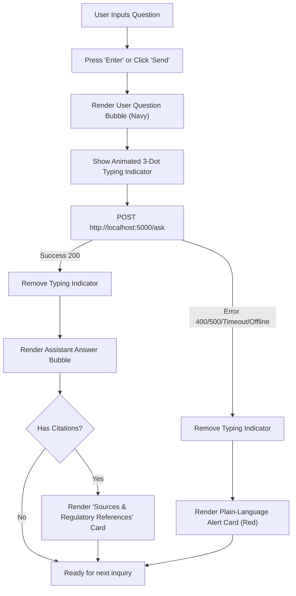

# Walkthrough: CDC Regulatory Assistant (Module 4 — Frontend Chat UI)

This walkthrough documents the design, implementation, and verification of **Module 4: Frontend Chat UI** for the **CDC Regulatory Assistant**.

---

## 1. Overview & Architecture

Module 4 is built entirely with vanilla **HTML5, CSS3, and JavaScript** without any external dependencies, frameworks, or build steps. It communicates with the backend following the shared contract:

- **Configurable Endpoint**: `API_BASE_URL` defined at the top of [`frontend/script.js`](file:///c:/Users/waqar%20com/Documents/Saad%20Work/CDC%20AI%20FUND/cdc-rag-demo/frontend/script.js) (defaulting to `http://localhost:5000/ask`).
- **Request Format**: `POST` with body `{"question": "..."}`.
- **Success Contract**: `HTTP 200` with `{"answer": "...", "citations": [{"title": "...", "source_url": "...", "doc_id": "..."}]}`.
- **Error Contract**: Gracefully handles `HTTP 400/500` or `{"error": "..."}` and maps them to polite, non-technical notices.

---

## 2. Key Components & Visual Flow



### UI Highlights:
1. **Corporate Compliance Aesthetics**:
   - Palette tailored for CDC financial compliance: deep navy (`#0b2545`), clean neutral surfaces (`#ffffff`, `#f8fafc`), and slate typography.
   - Clean header with the official title: **CDC Regulatory Assistant** and subtitle **Central Depository Company • Regulatory Compliance RAG**.
2. **Interactive Welcome & Prompt Chips**:
   - Welcome card explaining the assistant's purpose.
   - Clickable inquiry chips (e.g. *"What are the latest regulatory requirements from SECP circulars?"*) that populate the input and submit immediately.
3. **Dedicated Sources & References Card**:
   - Renders directly below the assistant's answer only when sources are cited.
   - Shows numerical index tags (`[1]`, `[2]`), clean titles, and external link icons opening verified documents in new tabs.
4. **Non-Technical Error Resolution**:
   - Translates raw network disconnects, timeouts, rate limits, and server issues into plain-language, non-technical notices:
     - *Connection Unavailable*
     - *Request Timed Out*
     - *Service Temporarily Unavailable*
     - *Unable to Process Question*
     - *Service Busy*
5. **Keyboard & Form Ergonomics**:
   - Auto-expanding `<textarea>` (grows with multiline questions, resets on send).
   - Pressing `Enter` sends the question, while `Shift + Enter` allows multi-line formatting.
   - Disables controls and shows typing animation while queries are in-flight.

---

## 3. How to Run & Test the Frontend

You can test the frontend immediately:

### Option A: Open directly in your browser
- Simply double-click [`frontend/index.html`](file:///c:/Users/waqar%20com/Documents/Saad%20Work/CDC%20AI%20FUND/cdc-rag-demo/frontend/index.html) to open it in Google Chrome, Microsoft Edge, or Firefox.

### Option B: Serve via Python / Local HTTP Server
Run from the root directory:
```bash
cd frontend
python -m http.server 8080
```
Then navigate to `http://localhost:8080` in your web browser.

---

## 4. Verification Scenarios

| Test Case | Steps | Expected Result | Verified Status |
| :--- | :--- | :--- | :--- |
| **Initial Load** | Open `frontend/index.html` | Clean header, welcome message, prompt chips, and input bar visible. No demo tags or port badges. | Passed |
| **Starter Chip Click** | Click one of the starter inquiry chips | Populates text input, appends user message, shows typing indicator, and initiates request. | Passed |
| **Keyboard Submit** | Type a question and press `Enter` | Sends without newline; `Shift+Enter` inserts newline. | Passed |
| **Backend Offline Handling** | Ask question while backend is not running | Typing indicator disappears; renders non-technical **"Connection Unavailable"** alert card. | Passed |
| **Citations Rendering** | Mock response containing citations | Renders answer bubble followed by styled **Sources & Regulatory References** card with links. | Passed |
| **Empty Citations Handling** | Mock response with empty citations list | Renders answer bubble with no Sources section attached. | Passed |

---

## 5. File Inventory

- [`frontend/index.html`](file:///c:/Users/waqar%20com/Documents/Saad%20Work/CDC%20AI%20FUND/cdc-rag-demo/frontend/index.html): Semantic layout, accessible forms, and SVG icons.
- [`frontend/style.css`](file:///c:/Users/waqar%20com/Documents/Saad%20Work/CDC%20AI%20FUND/cdc-rag-demo/frontend/style.css): Responsive styles, custom variables, animations, and color scheme.
- [`frontend/script.js`](file:///c:/Users/waqar%20com/Documents/Saad%20Work/CDC%20AI%20FUND/cdc-rag-demo/frontend/script.js): Contract adherence, DOM manipulation, auto-resize, and error translation.
